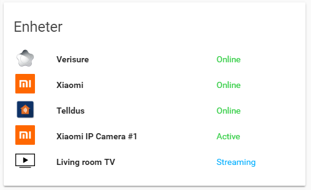

# Home-Assistant / Custom Entities Card
A simple custom entities card for [home-assistant](https://hass.io) (UI Lovelace)

## What can it do? and Why?
Supports adding multiple entities in a card, like the normal entities card in hass.

### Rewriting of entity states
Rewriting of an entity state to custom strings

Take the default device_tracker for example, the state will be 'home' or 'not_home'.
Let's say you want to add a device status card for your zigbee, zwave, etc. gateways.
I personally don't like that the state shows 'home' or 'not_home', of course I know it's home.. but is it online?
I understand that 'home' means 'Online', but for added WAF it's nice to give the 'actual' state, like 'Online'.

#### Custom coloring of text depending on state
Show a custom text color based on the entity state.
It gives an easier overview in the entity states card...

### Custon icon
Define a custom icon image for the entity.
I like to be able to change the icon in the UI instead of in home assistant, 
because it shows results faster. (No hass realoading, restarting of services, etc.)


### Example installation / configuration

For a default install, place the **custom-entities-card.js** in /etc/homeassistant/www/ directory.
Run **mkdir -p /etc/homeassistant/www/icons/** to create the icon directory.
Dump any icon image to the **/etc/homeassistant/www/icons** directory, you can reference these in your **ui-lovelace.yaml**

**Example snip from ui-lovelace.yaml**:
```
  - url: /local/custom-entities-card.js
    type: js


  - type: custom:custom-entities-card
    title: Devices
    entities:
      - {entity: device_tracker.xxxxxx, name: 'Verisure', 'icon': 'verisure.jpg',
          'rewrite': {'home': 'Online', 'not_home': 'Offline'},
          'colors': {'Online': '#2ecc40', 'Offline': '#ff4136'}}
      - {entity: device_tracker.xxxxx, name: 'Xiaomi', 'icon': 'xiaomi.png',
          'rewrite': {'home': 'Online', 'not_home': 'Offline'},
          'colors': {'Online': '#2ecc40', 'Offline': '#ff4136'}}
      - {entity:  device_tracker.xxxx, name: 'Telldus', 'icon': 'telldus.jpg',
          'rewrite': {'home': 'Online', 'not_home': 'Offline'},
          'colors': {'Online': '#2ecc40', 'Offline': '#ff4136'}}
      - {entity:  device_tracker.xxxx, name: 'Xiaomi IP Camera #1', 'icon': 'xiaomi.png',
          'rewrite': {'home': 'Active', 'not_home': 'Inactive'},
          'colors': {'Active': '#2ecc40', 'Inactive': '#ff4136'}}
```


